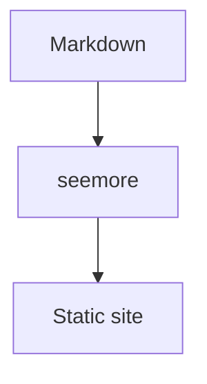

# Getting started

Install it, point it at a folder, done. See the [guide](./guide/index.md).

```ts
import { defineConfig } from 'seemore';

export default defineConfig({ title: 'My Docs' });
```



```d2
Markdown -> seemore -> Static site
```
