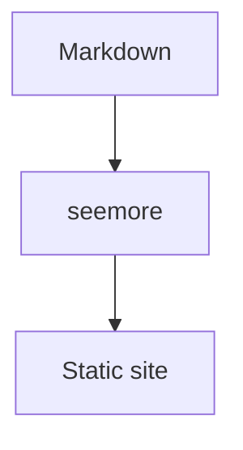

# Features

Every page arrives with its full text already in it — no placeholder, no loading skeleton — pages start loading as soon as you point at a link, and transitions animate, without giving up the plain-files output described under [publishing](./publishing.md). Add, rename, retitle, reorder or delete a file and the running preview updates immediately: no restart, no full reload.

Search works out of the box with no server to run and nothing to pay for; if your site grows past what a no-server search index can carry, the build tells you and points at alternatives. If your site lives under a path like `example.com/my-repo/` rather than the root, set `base` once and links, search and assets all follow.

## Edit from the page

While the preview is running, the page is also an editor. Double-click any paragraph, heading, list item, quote or table cell and it opens in place with that block's **Markdown source** — `**bold**` stays `**bold**`, links stay links. Fix the text and hit **Save**: the change is written straight back to the file, and the page hot-reloads exactly as it does for an edit made in your editor. Nothing is written until you say so: clicking away closes the editor without saving, and once you have typed something it stays open rather than discarding your text.

It works the same in the [code editor extension](./code-editor.md), whose panel runs the same dev server.

Inline editing is for local previews only — `seemore build` output is static, so nothing is emitted there.

## PDF viewer

A PDF referenced with image syntax opens inline in the browser's own viewer, with a download link underneath — a sibling file or a remote URL both work:

```md

```


## Diagrams

A ` ```mermaid ` or ` ```d2 ` code fence renders live in the browser, no build step or external service.

**Mermaid**



**D2**

```d2
Markdown -> seemore -> Static site
```

## Image zoom

Click any content image to zoom in, on by default. Turn it off with `'content.image.zoom': false`.


## Page actions

An **Actions** button above every page holds actions for the page you are reading:

- **Export as HTML** — the page alone, in one self-contained HTML file: styles inlined, images embedded, diagrams kept. It opens offline, from a double-click, ready to share. The same export runs from the CLI as `npx seemore export <file>`, which writes the file next to the Markdown (or into `--out <dir>`). Printing that file — or the live page — strips every bit of chrome and splits nothing across a page break, so the browser's own "Save as PDF" is a PDF away.

Actions are enabled per site, in the order they should appear, in `seemore.config.ts`:

```ts
// seemore.config.ts
export default {
  pageActions: ['export-html'],  // the default
  // pageActions: [],            // no button at all
};
```

Exported files keep the theme toggle, code copy buttons, click-to-zoom and an "On this page" list; they leave behind the sidebar, navbar and search. Like the site, an exported file opens in the reader's own OS theme — not the one the exporter happened to be using — and remembers their toggle choice from then on. Remote images (for example, GitHub URLs) stay remote — everything local is embedded.

## Feature flags

A set of switches for readers who want fine control, set on the `features` key in `seemore.config.ts`. Name a flag and set it `true` to turn it on, `false` to turn it off.

```ts
// seemore.config.ts
export default {
  features: {
    'navigation.path': true,               // off by default → this turns it on
    'navigation.instant.prefetch': false,  // on by default → this turns it off
  },
};
```

Flags you don't mention are left at their default, so you only ever name the ones you're changing.

| Flag | Default | Effect |
| --- | --- | --- |
| `navigation.instant.prefetch` | on | Load the target page on hover |
| `navigation.instant.preview` | off | Hover popover showing the target page |
| `navigation.footer` | on | Previous and next links |
| `navigation.top` | on | Back-to-top button |
| `navigation.path` | off | Breadcrumbs |
| `navigation.sections` | off | Top-level entries as sidebar groups |
| `navigation.prune` | off | Render only the visible subtree |
| `toc.follow` | on | Keep the active heading visible |
| `toc.integrate` | off | Merge the table of contents into the sidebar |
| `content.code.copy` | on | Copy button on code blocks |
| `content.action.edit` | on with `editLink` | Edit-this-page link |
| `content.edit` | on (dev only) | Double-click a block to edit its Markdown in place |
| `content.image.zoom` | on | Click-to-zoom on content images |
| `search.suggest` | on | Inline query completion |
| `search.highlight` | on | Highlight the query on the page you land on |
| `social.cards` | off | Per-page OG images (needs `takumi-js`) |

Combinations that can't work together raise a config error naming both flags and the fix.
