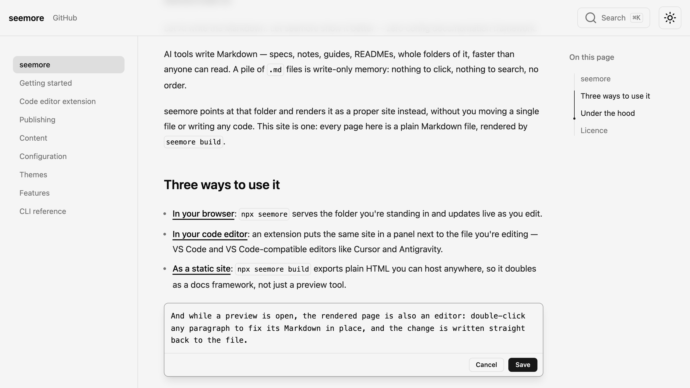

# seemore

Let AI write the Markdown. Let seemore show it better — zero config documentation framework.

AI tools write Markdown — specs, notes, guides, READMEs, whole folders of it, faster than anyone can read. A pile of `.md` files is write-only memory: nothing to click, nothing to search, no order.

**seemore** points at that folder and renders it as a proper site instead, without you moving a single file or writing any code. This site is one: every page here is a plain Markdown file, rendered by `seemore build`.

## Three ways to use it

- **[In your browser](./getting-started.md)**: `npx seemore` serves the folder you're standing in and updates live as you edit.
- **[In your code editor](./code-editor.md)**: an extension puts the same site in a panel next to the file you're editing — VS Code and VS Code-compatible editors like Cursor and Antigravity.
- **[As a static site](./publishing.md)**: `npx seemore build` exports plain HTML you can host anywhere, so it doubles as a docs framework, not just a preview tool.

And while a preview is open, the rendered page is also an editor: double-click any paragraph to fix its Markdown in place, and the change is written straight back to the file.

## Features

- **Zero config** — no config file, no code, no files to move; a plain folder of Markdown works in the browser, in your editor, and as a static build
- **Live preview** — add, rename, retitle or delete a file and the site updates immediately, navigation and search included
- **Edit in place** — double-click any block in the preview to fix its Markdown; saves are surgical, so `git diff` shows the sentence you changed and nothing else
- **Static export** — `seemore build` prerenders every page to HTML and writes each host's convention files (`_redirects`, `200.html`, `.nojekyll`, `404.html`) for you
- **Search built in** — static, zero-setup full-text search out of the box, with shareable highlighted results; [Algolia](https://algolia.com) and [Orama Cloud](https://orama.com) for hosted indexes
- **12 themes** — dark and light follow the system, with a toggle that remembers your choice; your own CSS always wins
- **Rich Markdown** — GitHub Flavoured Markdown, admonitions, steps, `[[wikilinks]]`, [Mermaid](https://mermaid.js.org) and [D2](https://d2lang.com) diagrams, click-to-zoom images, embedded PDFs
- **First-class code blocks** — build-time [Shiki](https://shiki.style) highlighting in the theme's own colours, with titles, line numbers, diff markers and focus
- **MDX components** — `<Callout>`, `<Card>`, `<CodeBlockTabs>` and friends, with no imports to write
- **Editor integration** — one extension covers VS Code, Cursor, Antigravity and other VS Code-compatible editors, remote workspaces included

## Under the hood

[fumadocs](https://fumadocs.vercel.app) provides the interface presets, with [Shiki](https://shiki.style), [Mermaid](https://mermaid.js.org), [D2](https://d2lang.com), [Vite](https://vite.dev) and [React Router](https://reactrouter.com) underneath. The code editor extension runs the same CLI as a child process it manages. Bug reports and pull requests are welcome at [github.com/arifszn/seemore](https://github.com/arifszn/seemore).

## Licence

[MIT](https://github.com/arifszn/seemore/blob/main/LICENSE)
