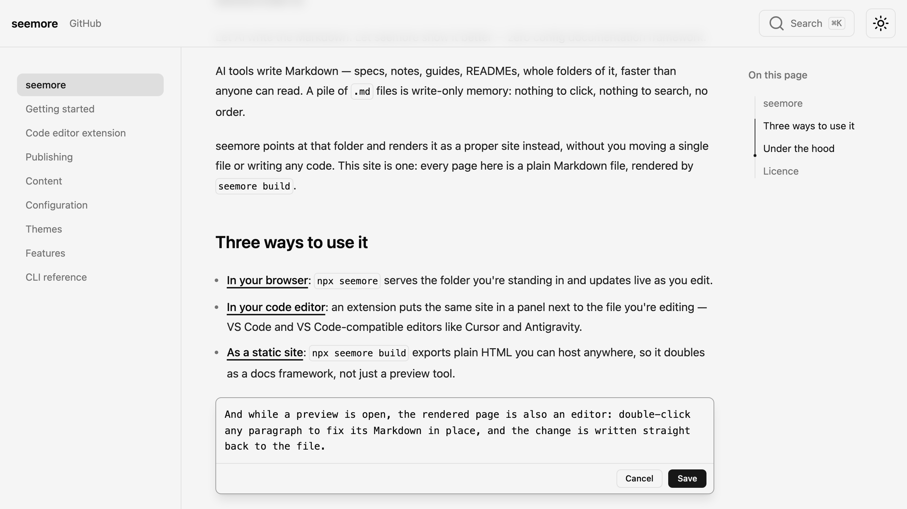

import promo from './assets/seemore.mp4';

<h1 className="seemore-hero-title">
  Let AI write the Markdown. 
  Let seemore show it better.
</h1>

  AI tools write Markdown fast: specs, notes, guides, READMEs, whole folders of it. A folder of
  `.md` files has no order: nothing to click, nothing to search. **seemore** points at that folder
  and renders it as a real site. It does not move a single file or need any code.

zsh · ~/notes

  ~/notes
  ❯
  npx seemore
  

  seemore
  {"http://localhost:4040"}

24 pages from ~/notes

<svg className="seemore-hero-arrow" viewBox="0 0 44 24" fill="none" stroke="currentColor" strokeWidth="1.5" strokeLinecap="round" strokeLinejoin="round" aria-hidden="true">
  <line x1="3" y1="12" x2="37" y2="12" />
  <polyline points="29 4 38 12 29 20" />
</svg>

  
  

  
  

  <Link className="seemore-btn seemore-btn-primary" href="/download">Download Desktop App</Link>
  <Link className="seemore-btn seemore-btn-primary" href="/getting-started">Use CLI</Link>
  <Link className="seemore-btn seemore-btn-secondary" href="https://github.com/arifszn/seemore">View on GitHub</Link>

zero config · static export · inline editing

## Two ways to use it

Same folder, same Markdown, wherever you look at it.

<Link className="seemore-way" href="/download">
  
    
      
        <svg viewBox="0 0 24 24" fill="none" stroke="currentColor" strokeWidth="1.5" strokeLinecap="round" strokeLinejoin="round">
          <rect x="2" y="4" width="20" height="13" rx="2" />
          <line x1="8" y1="21" x2="16" y2="21" />
          <line x1="12" y1="17" x2="12" y2="21" />
        </svg>
      
      In the desktop app
    
    Open a folder or a .md file as a site, with an integrated terminal. For macOS, Windows and Linux.
  
</Link>

<Link className="seemore-way" href="/getting-started">
  
    
      
        <svg viewBox="0 0 24 24" fill="none" stroke="currentColor" strokeWidth="1.5" strokeLinecap="round" strokeLinejoin="round">
          <rect x="3" y="4" width="18" height="16" rx="2" />
          <line x1="3" y1="9" x2="21" y2="9" />
          <circle cx="6.5" cy="6.5" r="0.6" fill="currentColor" stroke="none" />
          <circle cx="8.7" cy="6.5" r="0.6" fill="currentColor" stroke="none" />
        </svg>
      
      In the terminal
    
    npx seemore serves the folder you are in to your browser and updates live as you edit.
  
</Link>

## What you get

Point seemore at any Markdown you already have: AI-written notes, project docs, RFCs, API
references, specs, an engineering handbook.

  <video src={promo} controls muted playsInline preload="metadata"></video>

<Cards>
  <Card
    title="Zero config"
    description="No config file, no code, no files to move. A plain folder of Markdown works in the browser, in your editor, and as a static build."
  />
  <Card
    title="Live preview"
    description="Add, rename, retitle or delete a file and the site updates immediately, navigation and search included."
  />
  <Card
    title="Edit in place"
    description="Double-click any block in the preview to fix its Markdown, and seemore writes the change straight back to the file."
  />
  <Card
    title="Editor integration"
    description="One extension covers VS Code, Cursor, Antigravity and other VS Code-compatible editors, remote workspaces included."
  />
  <Card
    title="Documentation framework"
    description="seemore build prerenders the whole site to HTML, ready to deploy anywhere, and writes each host's convention files for you."
  />
  <Card
    title="Password protection"
    description="Protect the built site with one shared password. No server is needed. Visitors unlock it in the browser."
  />
  <Card
    title="Page actions"
    description="Copy a page as Markdown, or export it as one self-contained HTML file to drop into Slack, email or an AI chat."
  />
  <Card
    title="Search built in"
    description="Static, zero-setup full-text search out of the box, with shareable highlighted results. Algolia and Orama Cloud for hosted indexes."
  />
  <Card
    title="Rich Markdown"
    description="GitHub Flavoured Markdown, admonitions, steps, [[wikilinks]], Mermaid and D2 diagrams, click-to-zoom images, embedded PDFs."
  />
  <Card
    title="Full MDX"
    description="When Markdown is not enough, .mdx pages take real JSX: your own components, inline SVG and custom CSS. This page is built that way."
  />
  <Card
    title="12 themes"
    description="Dark and light follow the system, with a toggle that remembers your choice. Your own CSS always wins."
  />
</Cards>

## How seemore is different

  Starts where your files already are
  Most docs frameworks need a project: a scaffold, a config file, a docs/ layout, a build step wired into your repo. seemore needs only a folder that already exists.

  Nothing to migrate, nothing to undo
  seemore never moves or rewrites your files. You can stop using it at any time, at no cost.

## Edit without leaving the page

While a preview is open, the rendered page is also an editor. Double-click any paragraph to fix
its Markdown in place. seemore writes the change straight back to the file.

  

