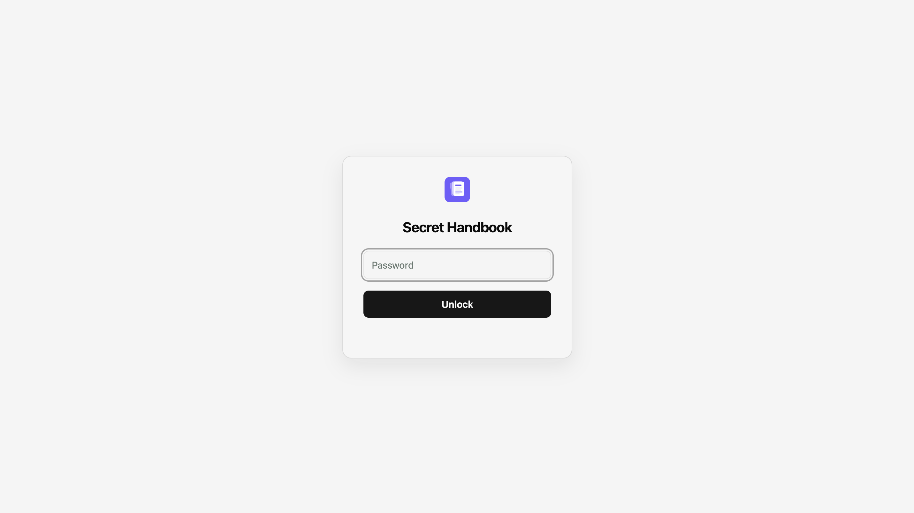

# Publishing

<CodeBlockTabs defaultValue="npm">
  <CodeBlockTabsList>
    <CodeBlockTabsTrigger value="npm">npm</CodeBlockTabsTrigger>
    <CodeBlockTabsTrigger value="pnpm">pnpm</CodeBlockTabsTrigger>
    <CodeBlockTabsTrigger value="yarn">yarn</CodeBlockTabsTrigger>
    <CodeBlockTabsTrigger value="bun">bun</CodeBlockTabsTrigger>
  </CodeBlockTabsList>
  <CodeBlockTab value="npm">

```bash
npx seemore build  # static export to dist/ for any host
```

  </CodeBlockTab>
  <CodeBlockTab value="pnpm">

```bash
pnpm dlx seemore build  # static export to dist/ for any host
```

  </CodeBlockTab>
  <CodeBlockTab value="yarn">

```bash
yarn dlx seemore build  # static export to dist/ for any host
```

  </CodeBlockTab>
  <CodeBlockTab value="bun">

```bash
bunx seemore build  # static export to dist/ for any host
```

  </CodeBlockTab>
</CodeBlockTabs>

The result is a `dist/` folder of plain web files. Drop it on [Netlify](https://netlify.com), [Surge](https://surge.sh), [Cloudflare Pages](https://pages.cloudflare.com) or [GitHub Pages](https://pages.github.com), or hand it to any web host. Every page is a separate `index.html`, next to a `404.html` that every static host reads. seemore also writes the files each host needs: `_redirects` for Netlify and Cloudflare Pages, `200.html` for Surge, `.nojekyll` for GitHub Pages.

> [!TIP]
> Do you publish to GitHub Pages at `username.github.io/my-repo/`, not at the root? Set the subpath once with `base: '/my-repo/'` (or `--base /my-repo/` on the CLI).

This site is built the same way. See its [`seemore.config.ts`](https://github.com/arifszn/seemore/blob/main/packages/site/seemore.config.ts) and the [features](./features.md) page for what publishing gives you by default.

## Password protection

Protect a whole site with one shared password. No server or account is needed. Turn it on in
`seemore.config.ts`:

```ts
// seemore.config.ts
export default {
  title: 'Acme Handbook',
  auth: true,
};
```

Keep the password out of the config file. `seemore build` reads it from the `SEEMORE_PASSWORD`
environment variable. The build fails if the variable is missing:

```bash
SEEMORE_PASSWORD='a-long-passphrase' npx seemore build
```

On Windows PowerShell:

```powershell
$env:SEEMORE_PASSWORD='a-long-passphrase'; npx seemore build
```



The build encrypts the site content and search index. The output is still a plain `dist/` folder that
you can deploy to any of the hosts above.

### Staying unlocked

`remember` sets how long a visitor stays unlocked after their last visit. The default is one day:

```ts
auth: { remember: '12h' }  // hours
auth: { remember: '7d' }   // days
```

Renaming the site logs everyone out once. To avoid that, set a stable `id`. Changing `id` logs everyone
out, just like changing the password:

```ts
auth: { id: 'acme-handbook' }
```

> [!NOTE]
> Password protection works only for `seemore build`. To try the lock screen, build with the password and serve
> `dist/` on `localhost`, for example with `npx serve dist` (build with `--base /` if the site sets `base`).
