# Themes

Twelve built-in colour presets: `neutral` (default), `black`, `catppuccin`, `dusk`, `ocean`, `purple`, `ruby`, `solar`, `aspen`, `emerald`, `vitepress`, `shadcn`. Set one with `theme` in [seemore.config.ts](./configuration.md).

Dark and light follow your system setting, with a toggle that remembers your choice — `black` is built for dark mode, shown below with the toggle on. For anything else, put your own CSS in `css`; it's appended last, so it wins.

| `neutral` (default) | `black` |
| :--- | :--- |
| 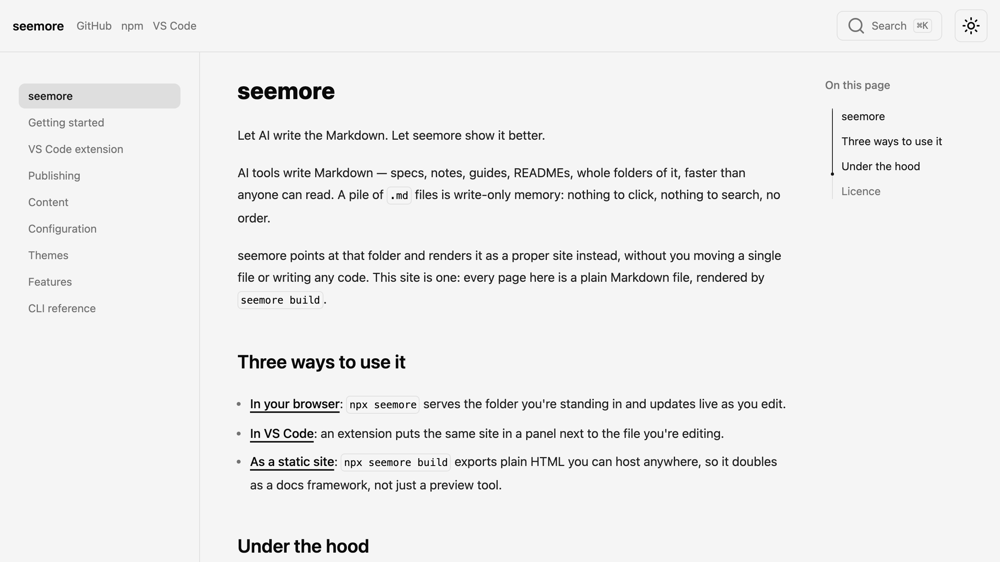 | 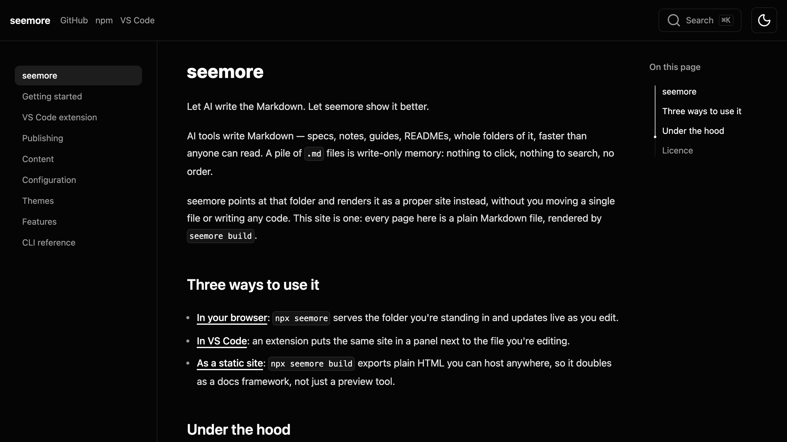 |

| `catppuccin` | `dusk` |
| :--- | :--- |
| 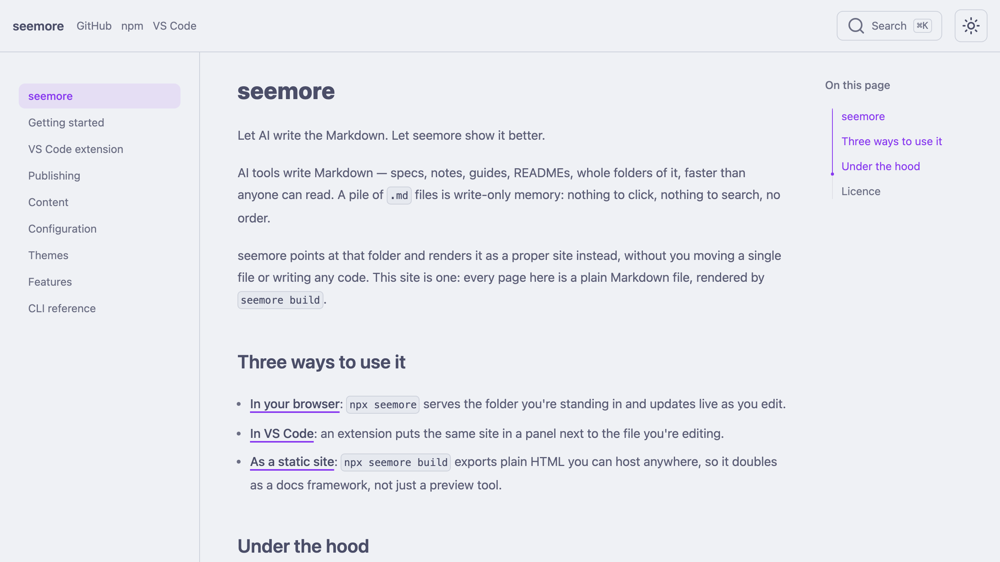 | 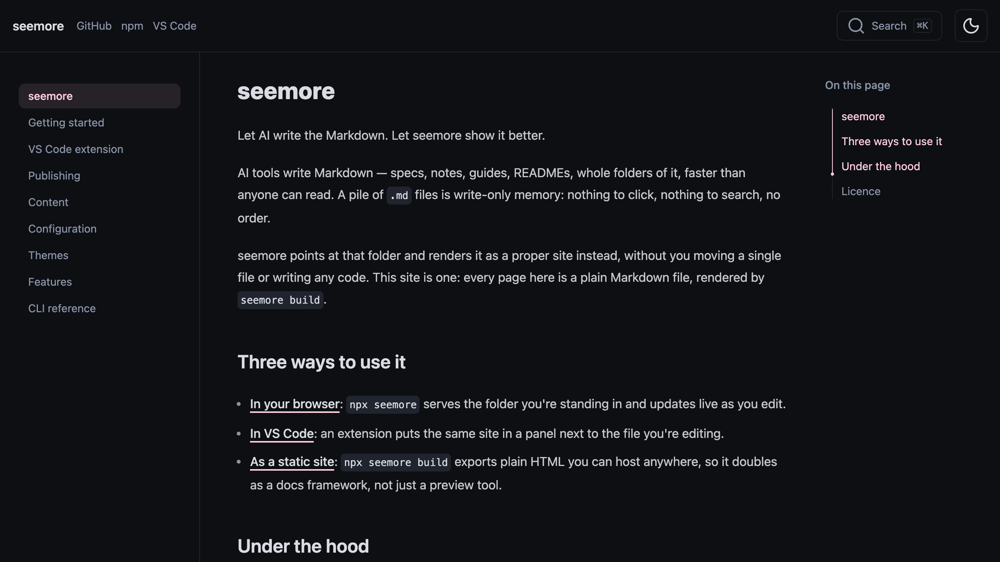 |

| `ocean` | `purple` |
| :--- | :--- |
| 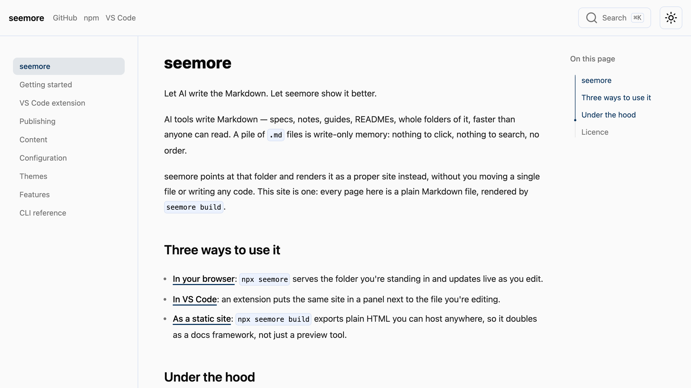 | 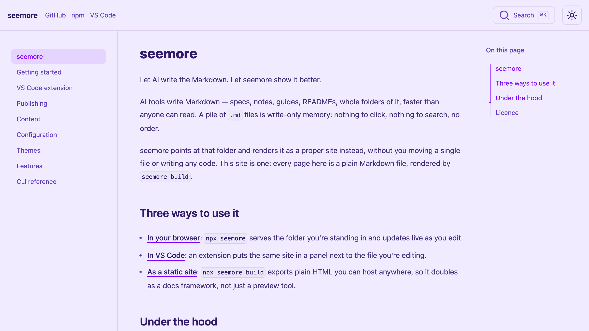 |

| `ruby` | `solar` |
| :--- | :--- |
| 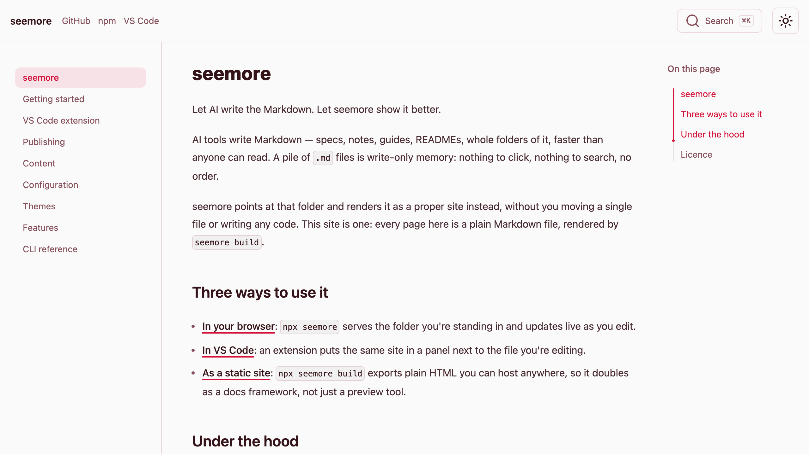 | 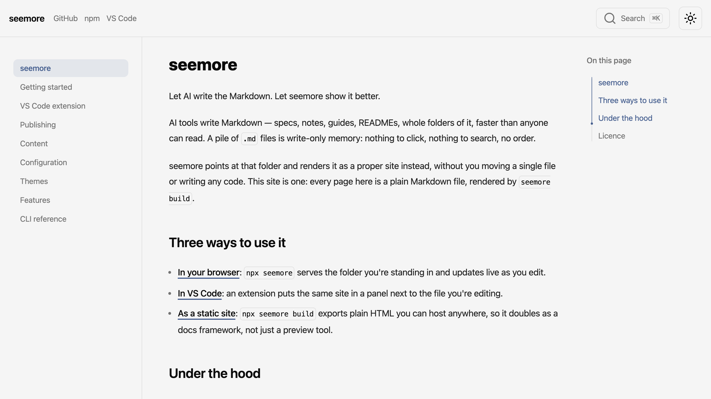 |

| `aspen` | `emerald` |
| :--- | :--- |
| 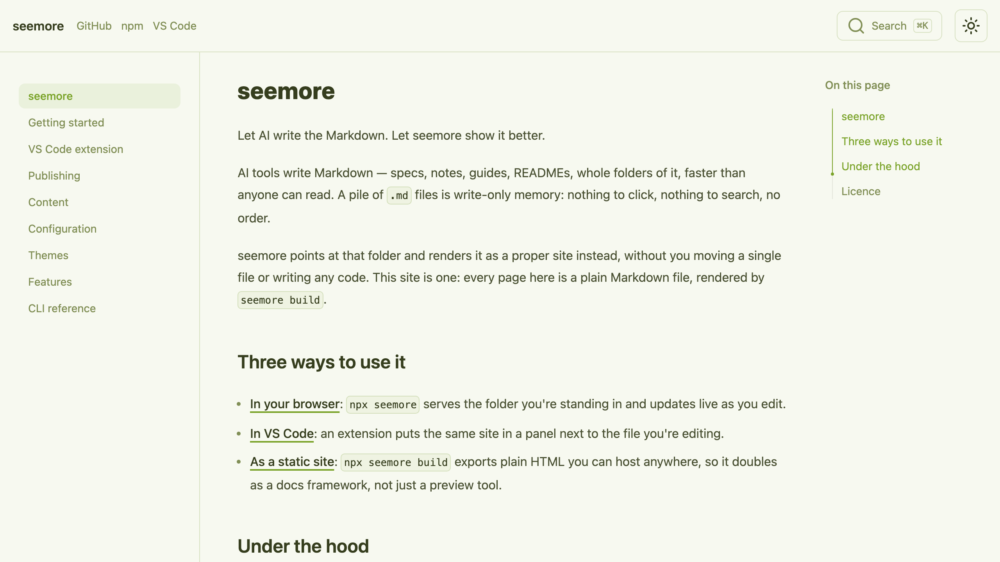 | 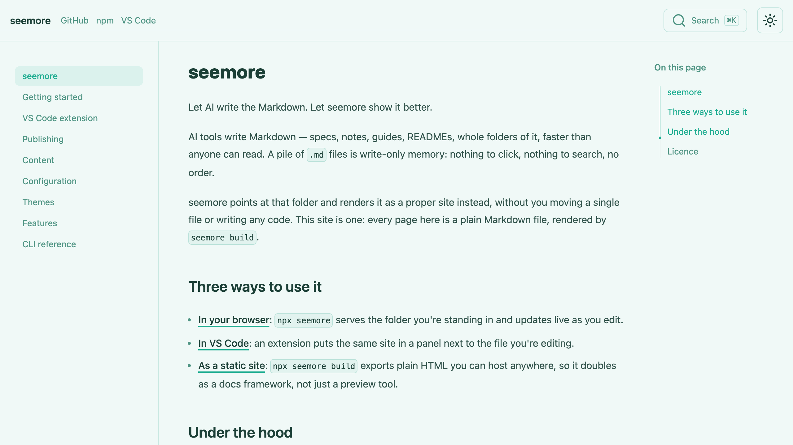 |

| `vitepress` | `shadcn` |
| :--- | :--- |
| 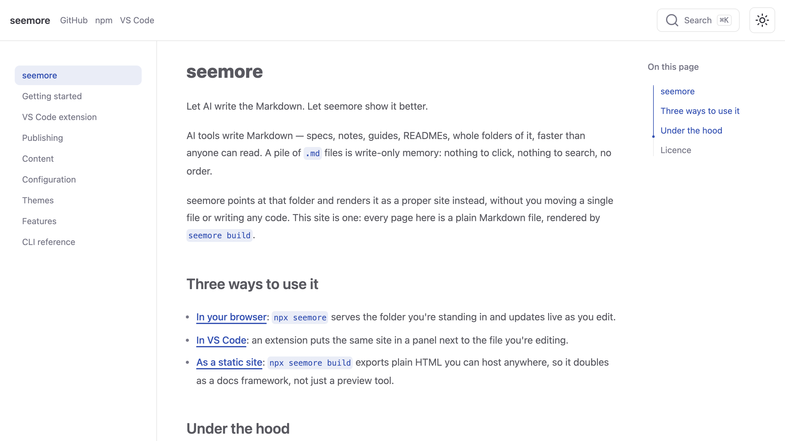 | 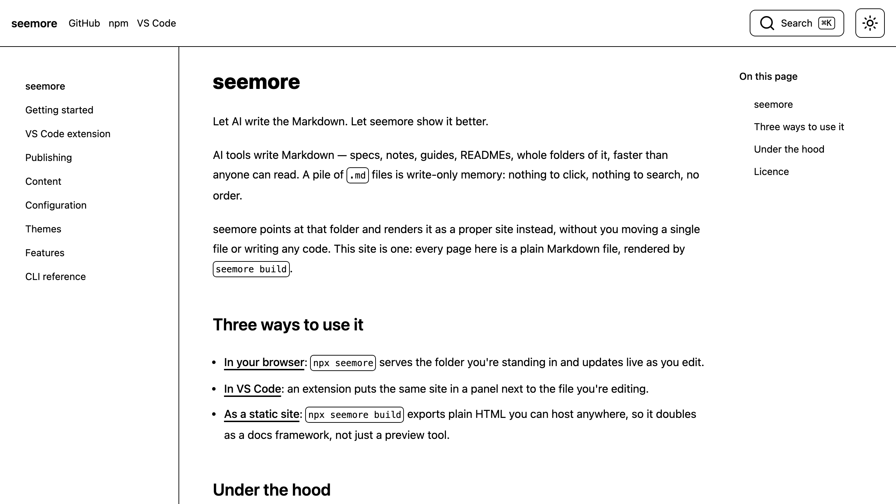 |
